# 🧠 AI Powered Blog App – MERN Stack Project

A feature-rich, production-ready full stack blog platform built with the **MERN stack** (MongoDB, Express.js, React.js, Node.js), integrated with **Google Gemini API** for AI-generated content and **ImageKit API** for seamless image handling.

This project demonstrates AI integration, full CRUD operations, admin panel functionality, RESTful API design, image CDN handling, and full stack deployment best practices.

---

## 📖 Project Overview

This blog application allows administrators to create and manage blog posts, auto-generate content using Google Gemini, and upload images using ImageKit. It supports:

- Blog creation with a rich text editor
- AI-based blog content generation
- Secure admin authentication
- Optimized image uploads using ImageKit
- Full dashboard with post management
- Responsive frontend with smooth client-side routing
- Deployment-ready frontend and backend

---

## ✨ Features

- 🧠 Generate blog content with **Google Gemini API**
- 🖼️ Upload & manage images via **ImageKit**
- 🔐 JWT-based admin login & authentication
- 📝 Full blog CRUD functionality (Create, Read, Update, Delete)
- 💬 Commenting system for readers
- 📊 Admin dashboard with analytics
- 🌐 Responsive, modern UI
- ⚡ Fast API & CDN-powered media
- 🛠️ Scalable backend with clean MVC structure

---

## 🔧 Tech Stack

**Frontend:** React.js, React Router DOM, Axios, React Quill  
**Backend:** Node.js, Express.js  
**Database:** MongoDB (with Mongoose ORM)  
**Authentication:** JWT (JSON Web Tokens)  
**AI:** Google Gemini API  
**Image CDN:** ImageKit  

---

## 🖼️ Screenshots

### 1. Add Blogs  
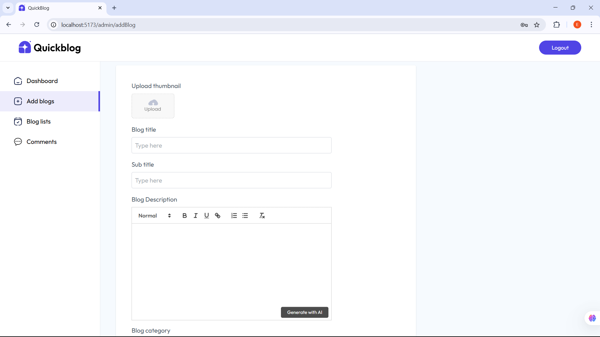

### 2. Admin Dashboard  
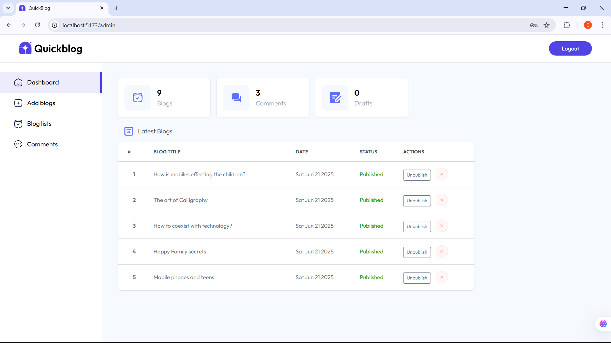

### 3. Admin Login Page  
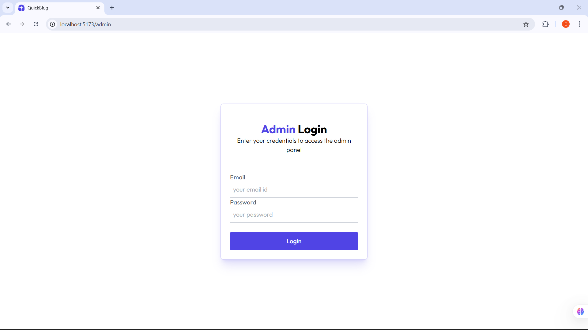

### 4. AI Generated Content  
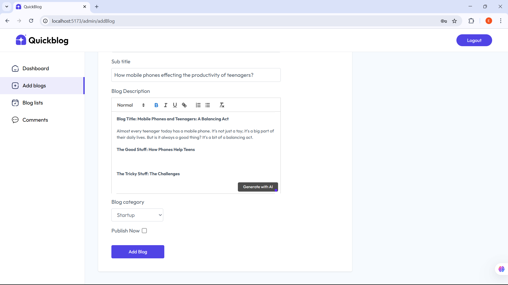

### 5. Blog Cards  
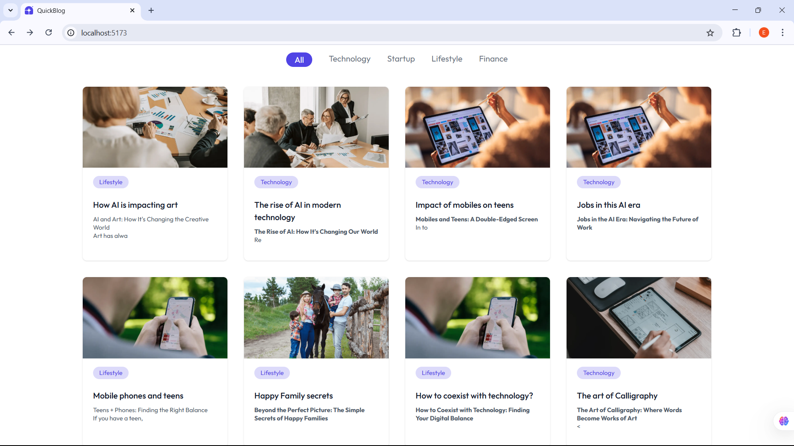

### 6. Blog Lists  
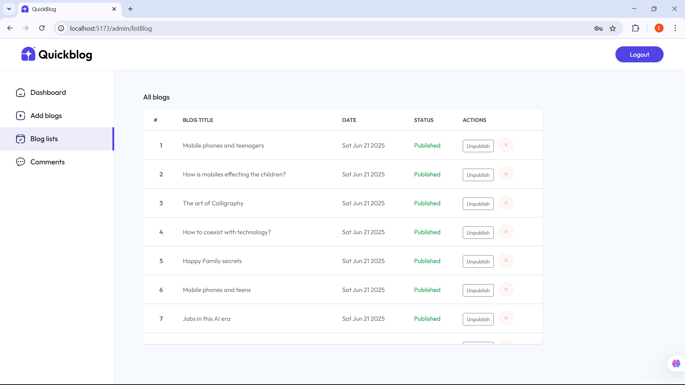

### 7. Generating Content with AI  
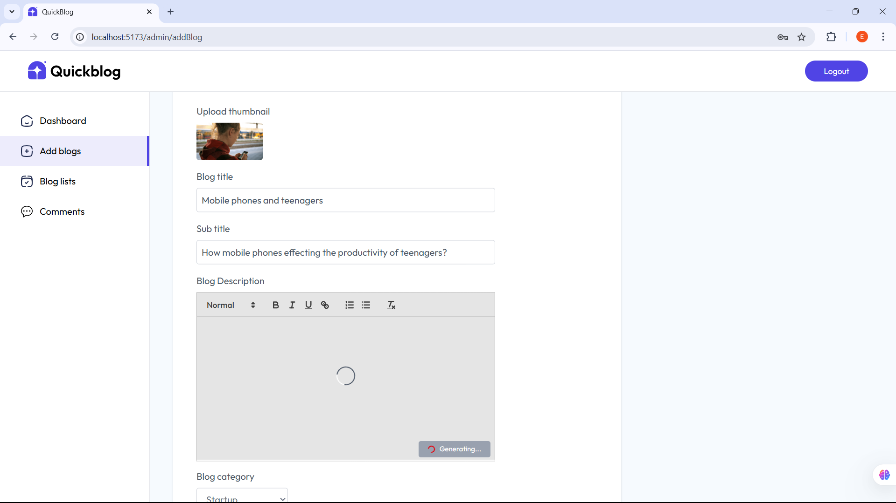

### 8. Navbar & Header  
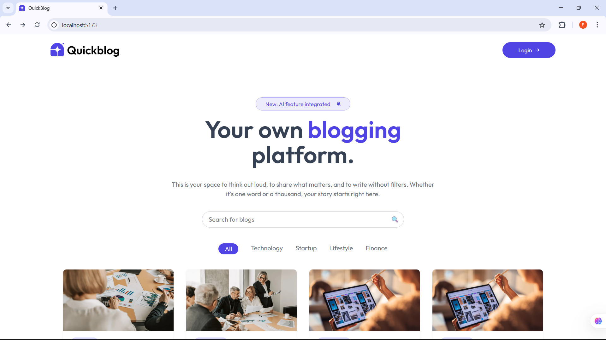

### 9. Newsletter & Footer  
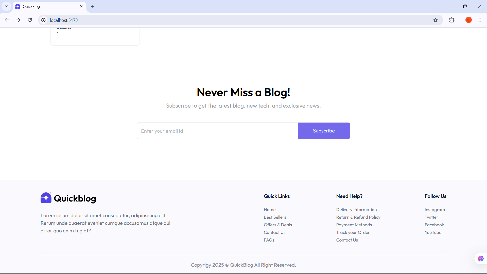

### 10. New Blog Created  
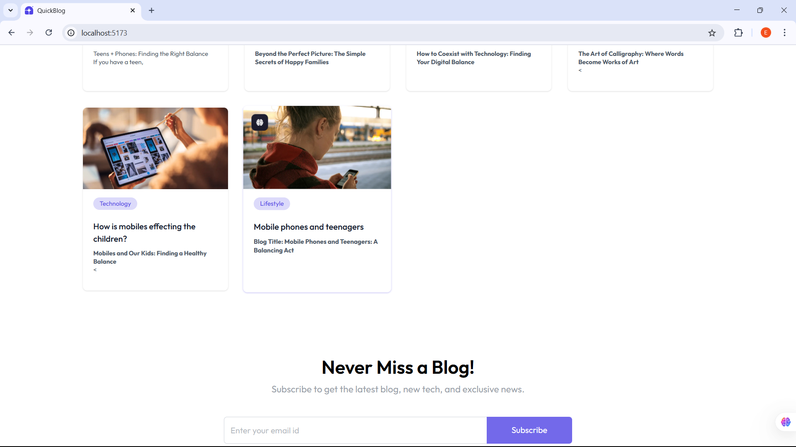

### 11. Blog Page  
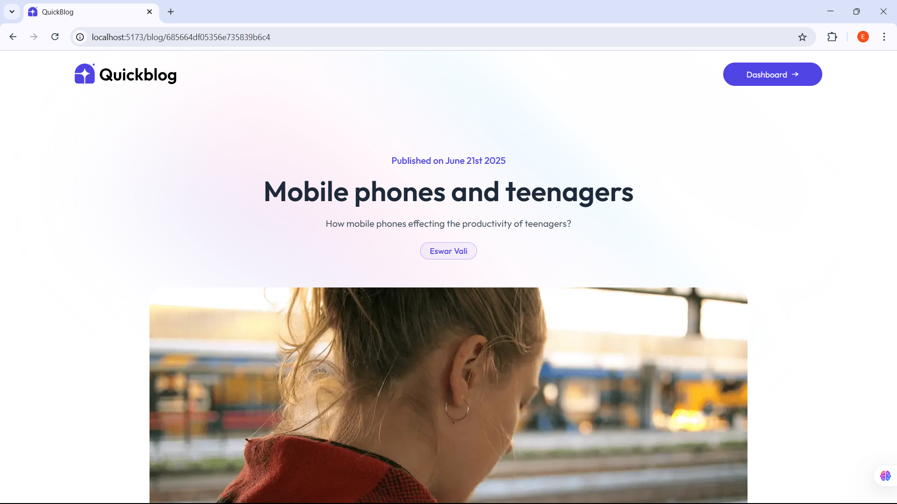

### 12. Add Comment  

### 13. Approve Comment  
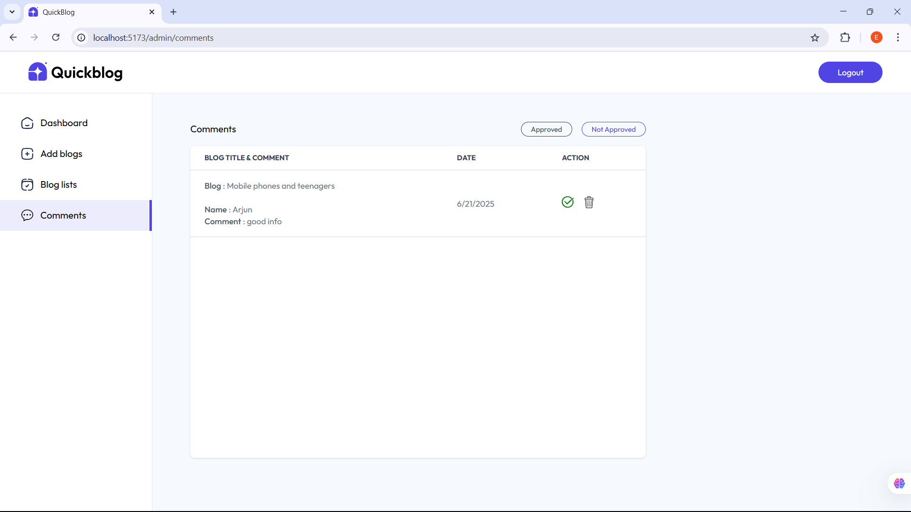

### 14. Email to Subscribers  
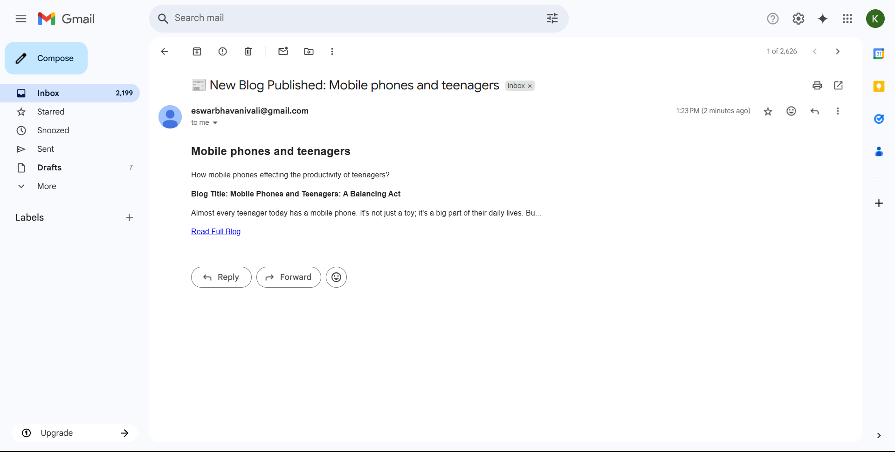

---

